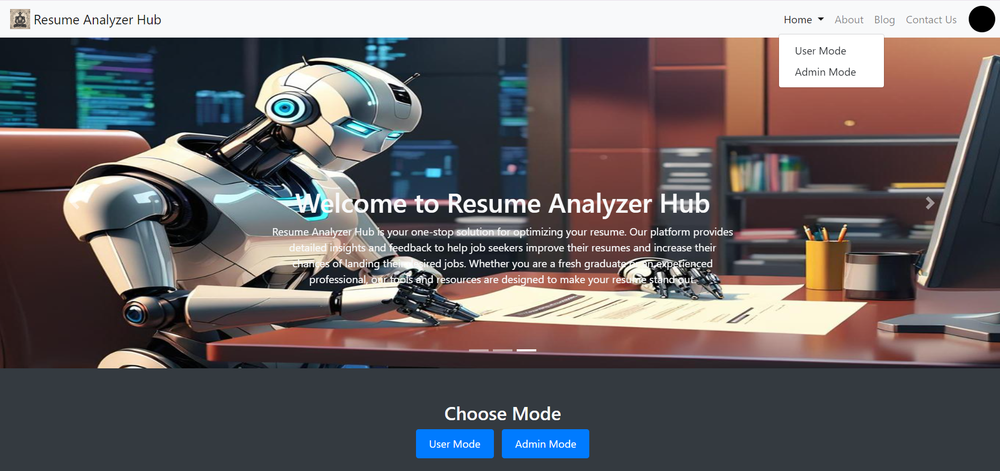

# 🎓📄 Resume Analysis Tool

## 📘 About the Project
The Resume Analysis Tool is a comprehensive web application designed to help job seekers analyze their resumes and provide actionable feedback. This tool scans resumes to extract key information and offers suggestions for improvement. It aims to enhance the quality of resumes, making them more attractive to potential employers. The tool utilizes natural language processing (NLP) techniques to parse the resume content and evaluate it against industry standards.

### Key Features:
- **PDF Resume Upload**: Users can upload their resumes in PDF format.
- **Detailed Analysis**: The tool extracts key skills and experiences and provides a detailed analysis.
- **Skill Recommendations**: It suggests skills that can be added to improve the resume.
- **Resume Scoring**: Provides a score based on various criteria to help users understand the strengths and weaknesses of their resumes.
- **Job Role Prediction**: Suggests potential job roles based on the resume content.
- **Admin Dashboard**: Allows administrators to view all user submissions, download data in Excel format, and visualize data through interactive charts.

The frontend is developed using HTML, CSS (Bootstrap), and JavaScript (Plotly for charts). The backend is built with Python and Flask, leveraging libraries like PyPDF2, NLTK, and spaCy for data extraction and analysis.

## 📈 Scope
This project aims to:
- Assist job seekers in enhancing their resumes by providing detailed feedback and suggestions.
- Predict suitable job roles for users based on the content of their resumes.
- Provide administrators with tools to manage and analyze user data effectively.
- Improve the overall quality of resumes, making job seekers more competitive in the job market.

## 🛠️ Tech Stack

### 🌐 Frontend
- **HTML**: For structuring the web pages.
- **CSS (Bootstrap)**: For styling the web pages and ensuring a responsive design.
- **JavaScript (Plotly for charts)**: For creating interactive charts and enhancing user interaction.

### 🖥️ Backend
- **Python**: The core programming language used for developing the application.
- **Flask**: A lightweight WSGI web application framework used for building the backend services.

### 📦 Modules
- **Flask**: For web framework.
- **Pandas**: For data manipulation and analysis.
- **Plotly**: For creating interactive data visualizations.
- **Bootstrap**: For responsive design and UI components.
- **PyPDF2**: For PDF parsing.
- **NLTK**: For natural language processing.
- **spaCy**: For advanced natural language processing.

## ⭐ Features

### 🔹 User Side
- 📤 **Upload PDF resumes** for analysis.
- 📊 **Receive detailed analysis reports** including:
  - Skill recommendations.
  - Resume scores.
  - Tips for improvement.
  - Predicted job roles.
- 🎥 **Access YouTube links** for tips on creating impactful resumes.

### 🔸 Admin Side
- 🗃️ **View all user submissions** and their analysis results.
- 📈 **Download user data** in Excel format.
- 📊 **Visualize user data** with interactive pie charts for job role and location distributions.

## 📋 Requirements
- Python 3.x
- Flask
- Plotly
- Pandas
- PyPDF2
- NLTK
- spaCy

## 🛠️ Setup and Installation Guide

<details>
<summary>🔧 Install Python</summary>

1. Download and install Python from [python.org](https://www.python.org/).
2. Ensure Python is added to your system PATH during installation.
</details>

<details>
<summary>🛠️ Set Up Virtual Environment (Optional but Recommended)</summary>

1. Open your terminal or command prompt.
2. Navigate to the directory where you want to set up your project.
3. Run the following commands:
    ```sh
    python -m venv venv
    source venv/bin/activate # On Windows, use `venv\Scripts\activate`
    ```
</details>

<details>
<summary>📂 Create the Project Directory</summary>

1. Create a new directory for your project:
    ```sh
    mkdir resume-analysis-tool
    cd resume-analysis-tool
    ```
</details>

<details>
<summary>📦 Install Required Packages</summary>

1. In the project directory, install the necessary Python packages:
    ```sh
    pip install Flask PyPDF2 NLTK spaCy Pandas Werkzeug Jinja2
    ```
</details>

<details>
<summary>📁 Directory Structure</summary>

1. Create the following directory structure within the `resume-analysis-tool` directory:
    ```
    resume-analysis-tool/
    ├── templates/
    │   ├── index.html
    │   ├── result.html
    │   ├── admin_result.html
    ├── static/
    │   └── images/
    ├── uploads/
    │   └── # Placeholder for uploaded resumes
    ├── your data/
    │   └── user_data.csv
    ├── venv/
    ├── app.py
    ├── requirements.txt
    ├── temp_resume.pdf
    ```
2. Ensure that the `templates` directory contains your HTML templates (`index.html`, `result.html`, `admin_result.html`).
3. Place any static files like images in the `static/images` directory.
4. Store uploaded resumes in the `uploads` directory.
5. Store user data in the `your data` directory.
</details>

<details>
<summary>🚀 Run the Application</summary>

1. In the terminal, navigate to the project directory.
2. Ensure the virtual environment is activated.
3. Run the Flask application:
    ```sh
    python app.py
    ```
4. Open a web browser and navigate to `http://127.0.0.1:5000`.
</details>

<details>
<summary>🖥️ Using VS Code</summary>

1. Open VS Code and the Project Folder
    - Open VS Code.
    - Open the `resume-analysis-tool` directory in VS Code.

2. Create and Activate Virtual Environment
    - Open the terminal in VS Code.
    - Create and activate the virtual environment in the terminal:
      ```sh
      python -m venv venv
      source venv/bin/activate # On Windows, use `venv\Scripts\activate`
      ```

3. Install Required Packages
    - Ensure the virtual environment is active.
    - Install the required packages using pip:
      ```sh
      pip install Flask PyPDF2 nltk spacy pandas Werkzeug
      ```

4. Run the Flask Application
    - In the VS Code terminal, run the Flask application:
      ```sh
      python app.py
      ```
    - Open a web browser and navigate to `http://127.0.0.1:5000`.
</details>

<details>
<summary>📥 Download and Installation</summary>

### Clone the Repository
```sh
git clone https://github.com/hrushi-17/resume-analysis-tool.git
cd resume-analysis-tool
```
</details>

<details>
<summary>📥 Download ZIP File</summary>

1. Go to [GitHub Repository](https://github.com/hrushi-17/resume-analysis-tool).
2. Click on the "Code" button.
3. Select "Download ZIP".
4. Extract the ZIP file.
5. Navigate to the extracted folder in your terminal.
6. Continue with the [setup and installation guide](#setup-and-installation-guide).
</details>

<details>
<summary>📝 License</summary>
Distributed under the MIT License. See `LICENSE` for more information.
</details>

<details>
<summary>🤝 Contributing</summary>
Contributions are what make the open-source community such an amazing place to learn, inspire, and create. Any contributions you make are **greatly appreciated**.

1. Fork the Project.
2. Create your Feature Branch (`git checkout -b feature/AmazingFeature`).
3. Commit your Changes (`git commit -m 'Add some AmazingFeature'`).
4. Push to the Branch (`git push origin feature/AmazingFeature`).
5. Open a Pull Request.
</details>

<details>
<summary>📞 Contact</summary>
Hrushikesh Chothe - hrushikeshchothe@gmail.com

Project Link: [https://github.com/hrushi-17/resume-analysis-tool](https://github.com/hrushi-17/resume-analysis-tool)
</details>

## 🚀 Usage
To use the application:
- Open the web application in your browser.
- **User Side**:
  - Upload a PDF resume.
  - View the detailed analysis and recommendations.
- **Admin Side**:
  - Log in to access user data.
  - Download reports and view data visualizations.

## 🛤️ Roadmap
The future developments for the Resume Analysis Tool include:
- Implementing user authentication and authorization for enhanced security.
- Integrating advanced AI-based analysis features for more accurate insights.
- Enhancing UI/UX for a more intuitive user experience.
- Scaling the application to handle higher traffic and concurrent users.

## 📸 Preview

### User Side



### Admin Side


